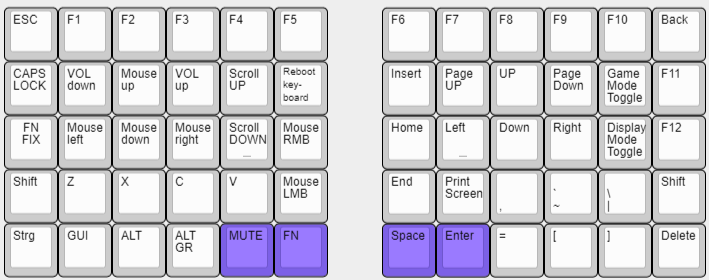

# MMDactyl - RP2040w Japanese Duplex Matrix

Welcome to MMDactyl, your custom-designed Dactyl keyboard powered by the RP2040w microcontroller. This keyboard is not only a functional input device but also a testament to precision engineering and innovative coding. Below, you'll find details on its development, coding progress, lasercut designs, completed steps, and what's next on the agenda.

## Coding Progress

The heart of MMDactyl lies in its meticulously crafted code. Currently at version 3.13, the code is fully functional, encompassing the fundamental layers, basic display functionality, and BIOS support. While wireless functionality is implemented with webserver and ntp integration, the focus remains on refining existing features and laying the groundwork for future enhancements, including energy-saving mechanisms. A Gaming mode was added wich eliminates unnecessary updates of the oled to increase performance so you can game with minimal inpud lag.

## Installation/Creation of raspberry pi pico

--> readme will follow for how to ...

## Lasercut Design

Crafted with precision, the lasercut design of MMDactyl ensures both aesthetic appeal and functional integrity. While the current files are fully functional, ongoing efforts are directed towards refining the design for enhanced aesthetics and ease of assembly.

## Completed Steps

MMDactyl has already achieved significant milestones, including:

- **Hardware Integration**: Successful integration into existing keyboard structures, replacing the Arduino Pro Micro seamlessly.
- **Code Adaptation**: The codebase has been tailored to suit the unique characteristics of MMDactyl, ensuring optimal performance.
- **Display Integration**: Display functionality is implemented, providing essential feedback without the need for wireless connectivity.
- **BIOS Compatibility**: MMDactyl operates seamlessly within BIOS environments, guaranteeing system-wide compatibility.
- **Layer Management**: The addition of a layer toggle button enhances user flexibility and workflow efficiency.
- **Data Management**: Runtime data tracking is functional, providing insights into keyboard usage patterns.
- **Web Interface Integration**: Creating a web interface accessible via the RP2040w for convenient settings adjustment and monitoring. --> Started with Version 3.04
- **Time Date**: Time and date synchronistation and displaying on oled from ntp server

## Next Steps

As we move forward, the focus will be on further refinement and feature expansion. Upcoming tasks include:

- **Changing out to RP2W with more security features**: Setting the Rp2w up with ciruitpython testing features and using new technology for storing the code!
- **Testing and Refinement**: Rigorous testing will ensure the stability and reliability of MMDactyl under various conditions.
- **Wiring Plan Completion**: Finalizing the wiring plan to optimize functionality and ease of assembly.
- **Display Enhancements**: Introducing additional display functionalities such as weather updates and keyboard status indicators./ for now only one option
- **Design Cleanup**: Refining the lasercut files to streamline production and enhance aesthetics.
- **Layer Expansion**: Implementing additional layers to accommodate diverse user preferences and workflows. --> stopped no need for my personal usage for now
- **Energy Management**: Introducing hibernation and energy-saving features to extend battery life and optimize power consumption. /started nearly finished - CPU reducing and Display clearing --> Missing wireless on/off
- **Data Expansion**: Further expanding data management capabilities, including key counter functionalities and customizable settings. --> Key counter implemented customizable settings planed (Keyboard layout definition over file (perhaps))

Stay tuned as MMDactyl evolves into a pinnacle of ergonomic design, technological innovation, and user-centric functionality.

## Bugfix

**3.13**:

- with Version 3.13 comes the first bugfix and not only feature update. When NTP not reaching the keyboard got stuck until it reached the timeout -- fixed now it only gets it time from the ntp when initializing and then it counts itself so no delay from internet needed

## Known Bugs

**3.13**:

- with Version 3.13 the bugfix for NTP is perfect but, another problem occured with long time use, the flash storage is getting really slow so with the next big Version Step which is already staged will fix this issue.

## Installation Guide:

Firmware + Libraries: https://github.com/SKZBadHabit/MMDactyl/blob/13bb51ad6b89758595acefa5d67b2ed847959f11/Libs/readme.md
Install to Raspberry: https://github.com/SKZBadHabit/MMDactyl/blob/913b7bfbf31d202d734bb9de5b815391ad87dade/Coding/README.md

## Preview of my actual keyboard layot:

### Layer 1

### Layer 2

