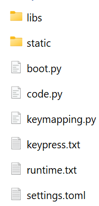
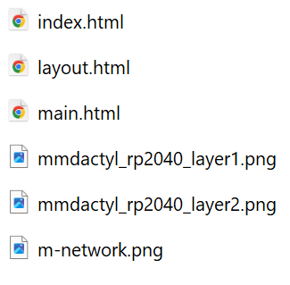
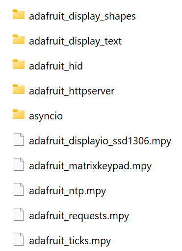

# Installation for MMDactyl on Raspberry pi pico on Circuitpython Firmware

## Download

downlad the latest Version from github

## Copy Codecopy the things inside the version folder (example: 3.13) to your flashed raspberry

Files under MMdactyl/code/3.13

## files for store data

create manually for installation

/runtime.txt

/keypress.txt

/settings.toml

## file Information:

boot.py for bios mode and write to file on rp

settings.toml --> saved secrets (add your Wifi credentials,...)

## Final Result

should look like this:

within static:

within libs:

